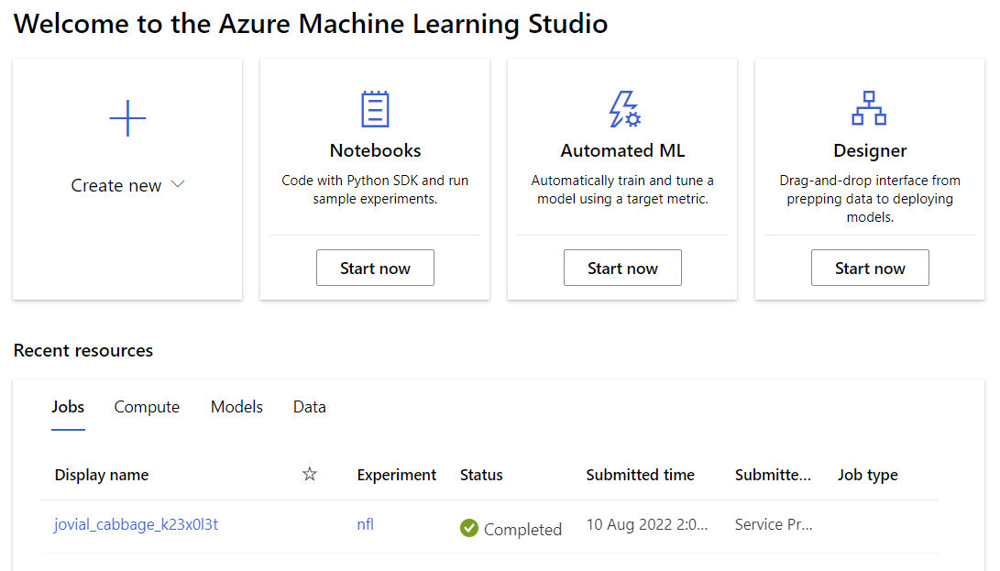
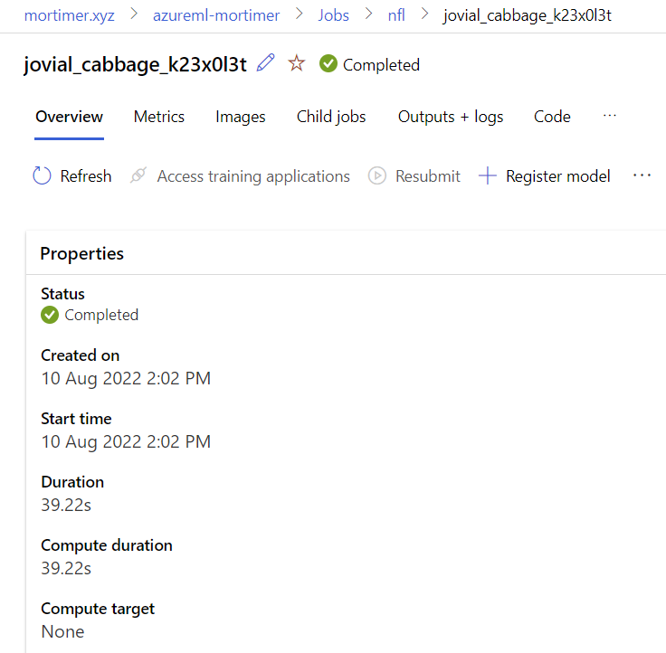
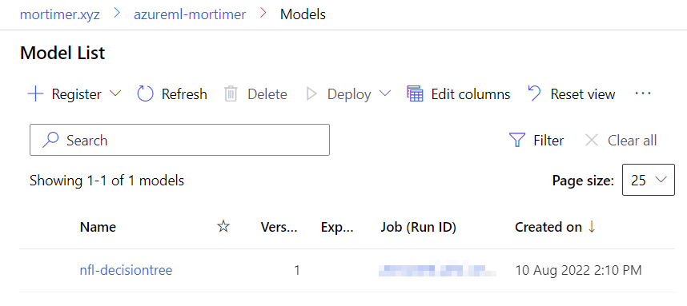
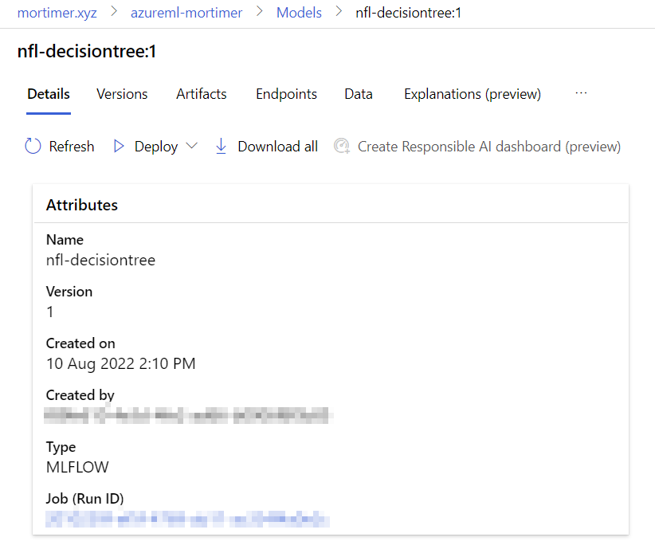

# Registering a model in AzureML from Databricks

What if we want to use AzureML as a central model repository for all models across many platforms (in this case Databricks workspaces). The AzureML model registry also uses MLFlow. I will follow these docs and show it step by step with examples.

[Docs](https://docs.microsoft.com/en-us/azure/machine-learning/how-to-use-mlflow-azure-databricks?tabs=azuremlsdk)

## Get things ready

There will be a few secrets we will need to maintain to get this going. The authentication we will use from Databricks to AzureML will be using an Azure Service Principal.

### Create a Service Principal

Firstly lets create a Service Principal in our Azure Active Directory. Using the Azure PowerShell module:

```ps1
az ad sp create-for-rbac --sdk-auth --name ml-auth --role Contributor --scopes /subscriptions/<subid>
```

You'll see output like the following JSON:

```json
{
  "clientId": "<guid>",
  "clientSecret": "<guid>",
  "subscriptionId": "<guid>",
  "tenantId": "<guid>",
  "activeDirectoryEndpointUrl": "https://login.microsoftonline.com",
  "resourceManagerEndpointUrl": "https://management.azure.com/",
  "activeDirectoryGraphResourceId": "https://graph.windows.net/",
  "sqlManagementEndpointUrl": "https://management.core.windows.net:8443/",
  "galleryEndpointUrl": "https://gallery.azure.com/",
  "managementEndpointUrl": "https://management.core.windows.net/"
}
```

### Create the secret scope

Using this output we will put the bits we will need in a Databricks secret scope. If you don't know how to do this using the Databricks cli you can follow this [Databricks CLI](https://docs.microsoft.com/en-us/azure/databricks/dev-tools/cli/). The main thing is to install it using `pip` and then configure it to authenticate to your workspace using `databricks configure -t <databricks-pat>`. Once you have done this you need to create a secret scope (I called mine `azureml`).

### Store the secrets

```bash
databricks secrets put --scope azureml --key clientId
databricks secrets put --scope azureml --key clientSecret
databricks secrets put --scope azureml --key subscriptionId
databricks secrets put --scope azureml --key tenantId
```

Let's also store some of the other info we need in the same secret scope while we are at it.

```bash
databricks secrets put --scope azureml --key subscriptionid
databricks secrets put --scope azureml --key resourcegroup
databricks secrets put --scope azureml --key workspacename
```

### Configure the external model registry

Now to configure your Databricks cluster to use the external MLFlow model registry you need to add this extra cell in your notebook:

```py
# Change the MLFlow tracking URI to the AzureML one
import os
from azure.ai.ml import MLClient
import azure.identity as azurei
import mlflow

# set environment variables for the service principal authentication of DefaultAzureCredential() getting details from the secret scope
os.environ["AZURE_CLIENT_ID"] = dbutils.secrets.get(scope = "azureml", key = "clientId")
os.environ["AZURE_TENANT_ID"] = dbutils.secrets.get(scope = "azureml", key = "tenantId")
os.environ["AZURE_CLIENT_SECRET"] = dbutils.secrets.get(scope = "azureml", key = "clientSecret")

# Enter details of your AzureML workspace getting details from the secret scope
subscription_id = dbutils.secrets.get(scope = "azureml", key = "subscriptionid")
resource_group = dbutils.secrets.get(scope = "azureml", key = "resourcegroup")
workspace_name = dbutils.secrets.get(scope = "azureml", key = "workspacename")

ml_client = MLClient(
    credential=azurei.DefaultAzureCredential(logging_enable=True),
    subscription_id=subscription_id,
    resource_group_name=resource_group
)

azureml_mlflow_uri = ml_client.workspaces.get(workspace_name).mlflow_tracking_uri
mlflow.set_tracking_uri(azureml_mlflow_uri)
print(azureml_mlflow_uri)
```

This should output the URI of your AzureML model registry.

```log
azureml://australiaeast.api.azureml.ms/mlflow/v1.0/subscriptions/[REDACTED]/resourceGroups/[REDACTED]/providers/Microsoft.MachineLearningServices/workspaces/[REDACTED]
```

## Train you model

Now, when we log any artifacts using MLFlow within Databricks, it will be logged against the MLFlow registry in AzureML.

```
mlflow.spark.log_model(spark_model=model, artifact_path="model")
```

Experiment list:  


Specific experiment:  


Model list:  

Specific model:  

