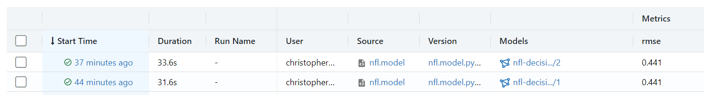

# Fit a decision tree model for predicting win or loss

We are again looking at the NFL season for 2014.


In the previous blog post we looked at how to take a series of CSV files and load them into Databricks as delta tables backed by parquet files.

This time we will demonstrate using Spark and MLFlow train a model and host an model serving REST end point.

## Visualizing data

Before we try to fit a model it is always a good idea to look at the distribution of the features. This example shows the distribution of the total yards.


## Using MLFlow to register model

We will use MLFlow to track our "experiments". Trained models and any other "artifacts" that you choose to log can be tracked using MLFlow. In this example we will track the RMSE and the trained model.

```py
mlflow.sklearn.autolog()

def trainModel():
  '''
    Train a Descision tree model
    Return:
      run_id: an UUID representing the MLFLow model run
  '''
  with mlflow.start_run():
    # The input features
    inputCols = ["TOTAL_FIRST_DOWNS", "PASSING_FIRST_DOWNS","YARDS_PER_PLAY","FUMBLES","TOTAL_YARDS","INTERCEPTIONS","PUNTS"]
    va = VectorAssembler(inputCols=inputCols,outputCol="features")
    # Define the Decision tree regressor
    dt = DecisionTreeRegressor(labelCol="WIN_LOSS_BINARY", featuresCol="features", maxDepth=4)
    evaluator = RegressionEvaluator(metricName = "rmse", labelCol="WIN_LOSS_BINARY")

    grid = ParamGridBuilder().addGrid(dt.maxDepth, [3, 5, 7, 10]).build()
    cv = CrossValidator(estimator=dt, estimatorParamMaps=grid, evaluator=evaluator, numFolds = 10)
    pipeline = Pipeline(stages=[va, dt])

    # Now call fit to train the model and then use MLFlow to log the model
    model = pipeline.fit(df)
    mlflow.spark.log_model(spark_model=model, artifact_path="model")

    # Log the RMSE to MLFlow
    predictions = model.transform(df)
    rmse = evaluator.evaluate(predictions, {evaluator.metricName: "rmse"})
    mlflow.log_metric("rmse", rmse)

    # Return the run
    run_id = mlflow.active_run().info.run_id
    return run_id

run_id = trainModel()

# Register the model
model_name = "nfl-decisiontree"
artifact_path = "model"
model_uri = f"runs:/{run_id}/{artifact_path}"

model_details = mlflow.register_model(model_uri=model_uri, name=model_name)
```

## MLFlow user interface

When this code has run, you will be able to see the experiment and the associated runs.




### Adding metadata

Once we click on the model we can see the RSME we logged and any other artifacts related to the trained model.


### Model lifecycle

MLFlow helps you to track the models and promote them through environments.


## Checking model outputs

Vizualising the tree.


## Feature importance

Feature importance is a measure of information gain. It is scaled from 0.
Let's map the features to their proper names to make them easier to read.

| Feature             | Importance |
| ------------------- | ---------- |
| INTERCEPTIONS       | 0.392      |
| TOTAL_YARDS         | 0.289      |
| FUMBLES             | 0.131      |
| YARDS_PER_PLAY      | 0.085      |
| PUNTS               | 0.035      |
| TOTAL_FIRST_DOWNS   | 0.034      |
| PASSING_FIRST_DOWNS | 0.030      |

## Model serving


### Testing the inference REST API

```json
{
  "columns": [
    "TOTAL_FIRST_DOWNS",
    "PASSING_FIRST_DOWNS",
    "YARDS_PER_PLAY",
    "FUMBLES",
    "TOTAL_YARDS",
    "INTERCEPTIONS",
    "PUNTS"
  ],
  "data": [[28, 15, 7.6, 1, 495, 0, 3]]
}
```

### Example of calling

Databricks provides some light weight examples of how to call it with CURL or Python. The example doesn't provide how to call with passing data.

```py
import os
import requests
import numpy as np
import pandas as pd

def create_tf_serving_json(data):
  return {'inputs': {name: data[name].tolist() for name in data.keys()} if isinstance(data, dict) else data.tolist()}

def score_model(dataset):
  url = 'https://<workspace>.azuredatabricks.net/model/nfl-decisiontree/1/invocations'
  headers = {'Authorization': f'Bearer {os.environ.get("DATABRICKS_TOKEN")}'}
  data_json = dataset.to_dict(orient='split') if isinstance(dataset, pd.DataFrame) else create_tf_serving_json(dataset)
  response = requests.request(method='POST', headers=headers, url=url, json=data_json)
  if response.status_code != 200:
    raise Exception(f'Request failed with status {response.status_code}, {response.text}')
  return response.json()
```
