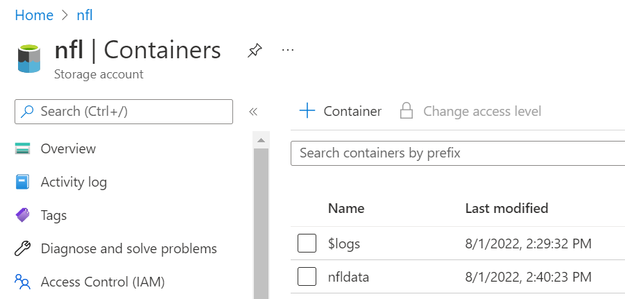
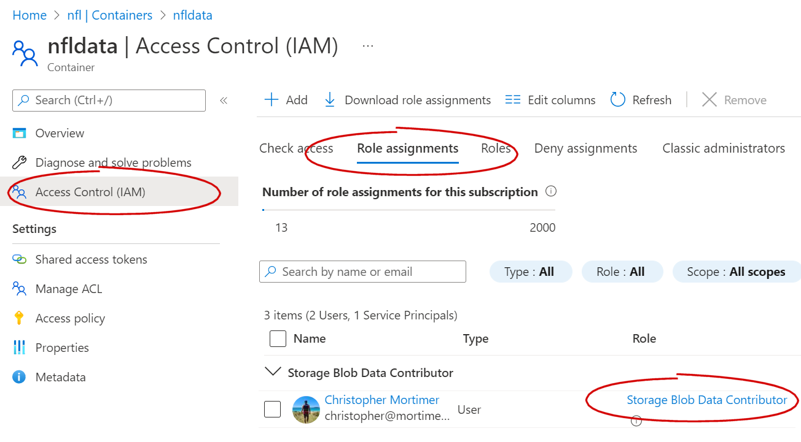
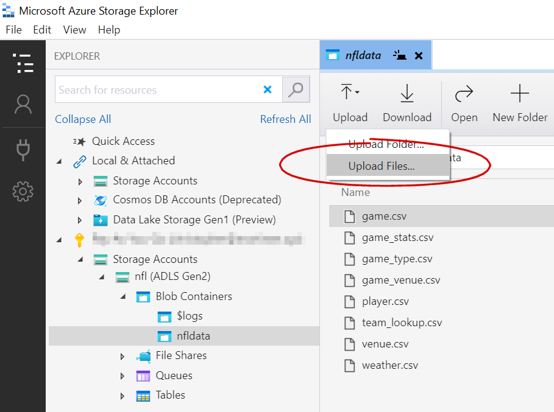
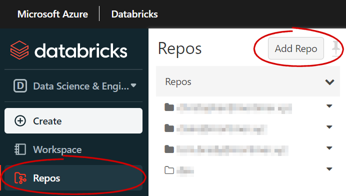
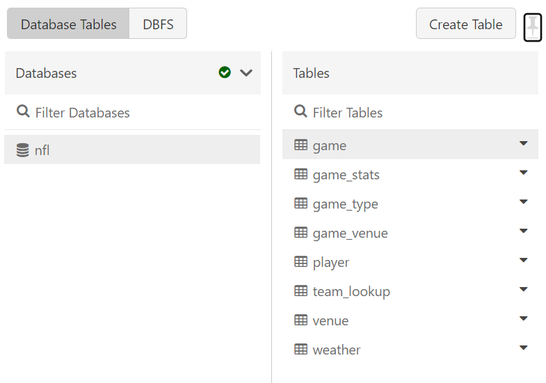

# Create a database with sample NFL data

This is using:

- Azure Databricks
- Azure Data Lake Storage (ADLS) Gen2

## Create your storage account and container

In this demo I have created a storage account called `nfl` and a container within the account called `nfldata`

I have added my Azure Active Directory account as a _Storage Blob Data Contributor_.


## Load data to ADLS

I am using Azure Storage Explorer to do this. You could also use the Azure portal, the azcopy cli or many other methods.



## Clone this repo to your Databricks



Open the notebook called `db.sql.py`

## Run the Notebook

1. First we will create the Hive database for the tables.

```sql
create database nfl
```

2. The notebook has two functions.
   - Reading a CSV file and creating a Delta table
   - Reading all files in an ADLS container and running the aforementioned function for each.



## Test the results

The notebook has a sample query to test the results.
This will get all players from the SF 49ers and sort them by the number rushing yards they had in each game.

```sql
select
  p.PLAYER_NAME
  , p.FIELD_POSITION
  , t.TEAM_SHORT
  , p.RUSHING_YARDS
  , p.PASSING_YARDS
from
  nfl.player p
  inner join nfl.team_lookup
on p.team_id = t.team_id
  and t.team_short = 'SF'
order by p.RUSHING_YARDS desc
```

For the 2014 NFL season, for the 49ers, Frank Gore and Colin Kaepernick were racking up the rushing yards.  
**Top 20**  
| - | PLAYER_NAME | FIELD_POSITION | TEAM_SHORT | RUSHING_YARDS | PASSING_YARDS |
| --- | ---------------- | -------------- | ---------- | ------------- | ------------- |
| 1 | Frank Gore | RB | SF | 158 | 0 |
| 2 | Colin Kaepernick | QB | SF | 151 | 114 |
| 3 | Frank Gore | RB | SF | 144 | 0 |
| 4 | Frank Gore | RB | SF | 119 | 0 |
| 5 | Frank Gore | RB | SF | 107 | 0 |
| 6 | Frank Gore | RB | SF | 95 | 0 |
| 7 | Frank Gore | RB | SF | 81 | 0 |
| 8 | Frank Gore | RB | SF | 66 | 0 |
| 9 | Colin Kaepernick | QB | SF | 64 | 248 |
| 10 | Frank Gore | RB | SF | 63 | 0 |
| 11 | Colin Kaepernick | QB | SF | 63 | 204 |
| 12 | Frank Gore | RB | SF | 63 | 0 |
| 13 | Colin Kaepernick | QB | SF | 58 | 218 |
| 14 | Carlos Hyde | RB | SF | 55 | 0 |
| 15 | Colin Kaepernick | QB | SF | 54 | 245 |
| 16 | Carlos Hyde | RB | SF | 50 | 0 |
| 17 | Frank Gore | RB | SF | 49 | 0 |
| 18 | Colin Kaepernick | QB | SF | 46 | 141 |
| 19 | Carlos Hyde | RB | SF | 43 | 0 |
| 20 | Frank Gore | RB | SF | 38 | 0 |
